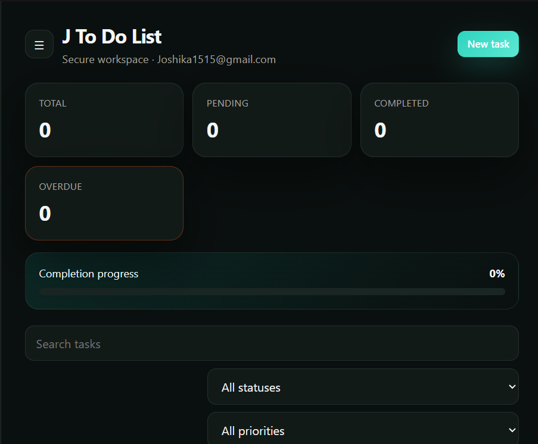
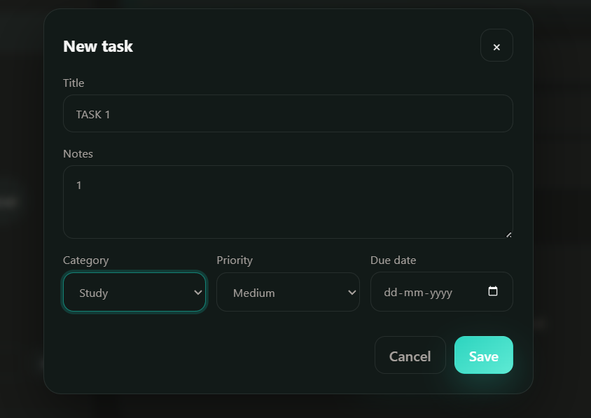
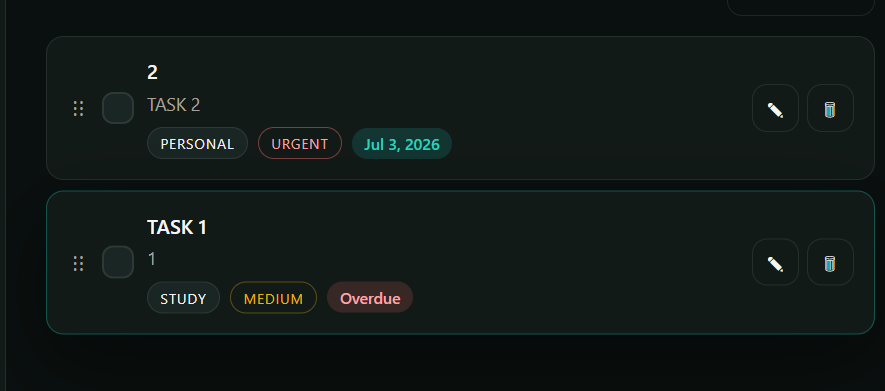
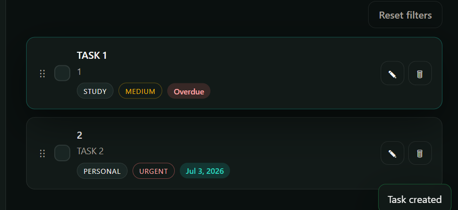
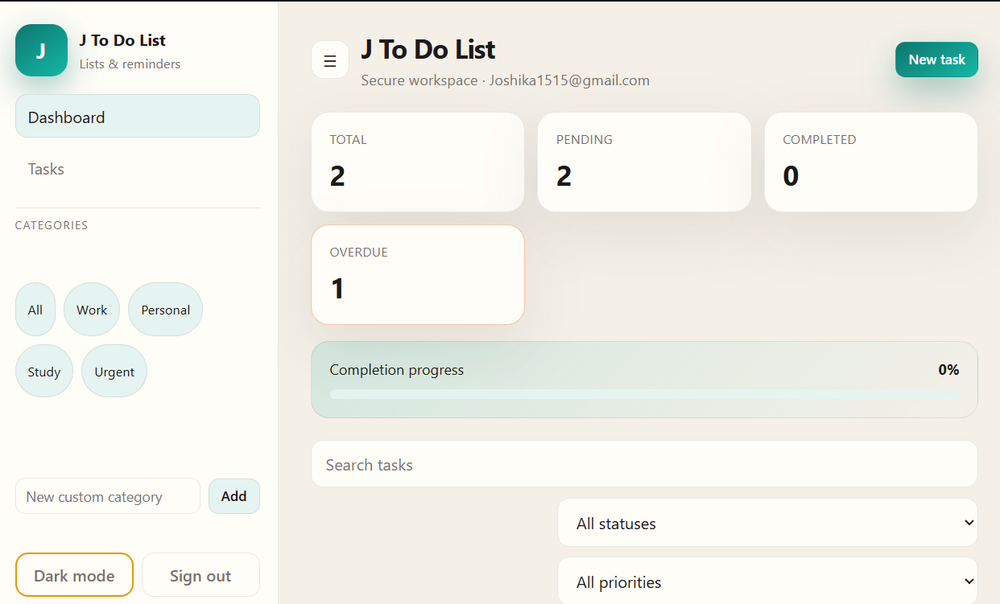
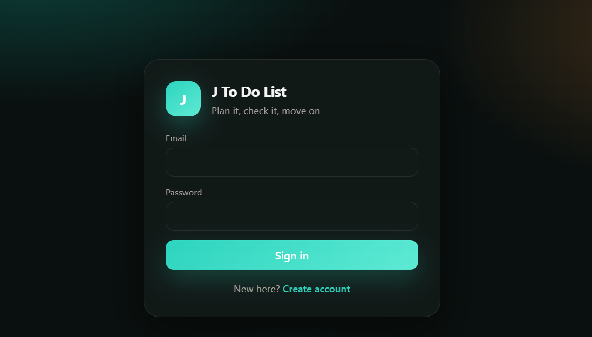
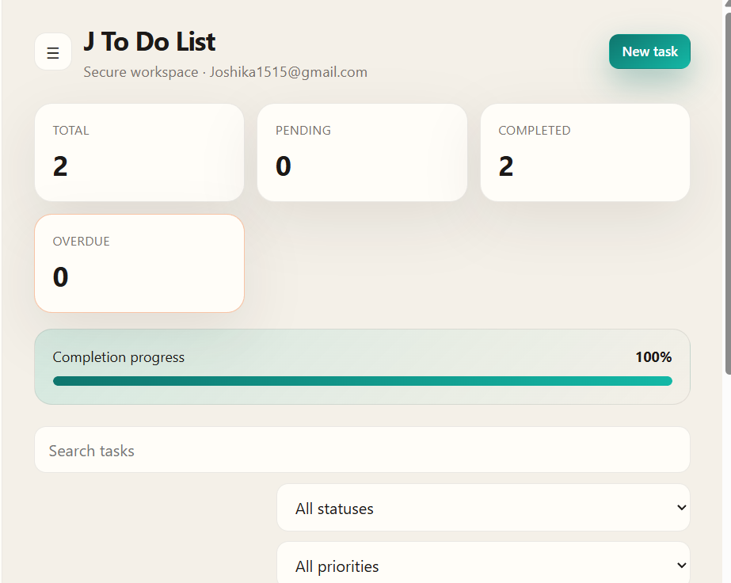

# J To Do List

J To Do List is a modern responsive productivity and workflow management application built using Meteor.js and Blaze templates. The application focuses on efficient task organization, workflow tracking, drag-and-drop task handling, and interactive dashboard management through a SaaS-inspired user interface.

The project demonstrates reactive frontend architecture, JavaScript ES6+ workflows, modular application structure, and scalable UI development practices.

---

# Features

## Authentication System
- User Registration
- Secure Login System
- Session Persistence
- Logout Functionality

## Task Management
- Create Tasks
- Edit Tasks
- Delete Tasks
- Mark Tasks as Completed
- Real-Time Reactive Updates

## Task Categories
- Work
- Personal
- Study
- Urgent
- Custom Categories

## Drag and Drop Workflow
- Interactive Task Rearrangement
- Smooth Drag-and-Drop Support
- Dynamic Task Ordering

## Priority Management
- Low Priority
- Medium Priority
- High Priority
- Urgent Priority
- Visual Priority Indicators

## Due Date Tracking
- Due Date Selection
- Overdue Task Detection
- Deadline Monitoring

## Search & Filters
- Instant Task Search
- Filter by Status
- Filter by Priority
- Filter by Category

## Dashboard Analytics
- Total Tasks Counter
- Completed Tasks Counter
- Pending Tasks Counter
- Overdue Tasks Counter
- Progress Tracking Overview

## User Interface
- Responsive Dashboard Design
- Sidebar Navigation
- Modern SaaS UI
- Dark / Light Theme
- Toast Notifications
- Interactive Components
- Mobile-Friendly Layout

---

# Technology Stack

| Technology | Purpose |
|---|---|
| Meteor.js | Full Stack Framework |
| Blaze | Reactive UI Rendering |
| JavaScript ES6+ | Application Logic |
| HTML5 | Markup Structure |
| CSS3 / SCSS | Styling & Responsive Design |
| SortableJS | Drag-and-Drop Features |
| Git & GitHub | Version Control |

---

# Project Structure

```bash
J-To-Do-List/
│
├── .meteor/
├── client/
├── imports/
│   ├── api/
│   ├── startup/
│   ├── ui/
│   └── utils/
├── server/
├── public/
├── tests/
├── screenshots/
│   ├── completion.png
│   ├── createaccount.png
│   ├── createtask.png
│   ├── dashboard.png
│   ├── draganddrop.png
│   ├── lightmode.png
│   ├── login.png
│   └── taskpng.png
├── package.json
├── package-lock.json
├── rspack.config.js
├── .gitignore
└── README.md
```

---

# Installation & Setup

## Prerequisites

Install the following:

- Node.js
- Meteor.js

Install Meteor globally:

```bash
npm install -g meteor
```

Verify installation:

```bash
meteor --version
```

---

# Clone Repository

```bash
git clone YOUR_GITHUB_REPOSITORY_LINK
```

Move into the project directory:

```bash
cd J-To-Do-List
```

---

# Install Dependencies

```bash
meteor npm install
```

---

# Run the Application

```bash
meteor run
```

The application will run at:

```bash
http://localhost:3000
```

---

# Production Build

```bash
meteor build ../build --architecture os.linux.x86_64
```

---

# Application Screenshots

## Dashboard



---

## Create Task



---

## Drag and Drop Workflow



---

## Task Management



---

## Light Mode



---

## Login Interface



---

## Create Account


---

## Completion Progress



---

# Future Enhancements

- Multi-User Collaboration
- Calendar Integration
- Activity Tracking
- Cloud Synchronization
- Notification Center
- Team Workspace Features
- Analytics Dashboard
- File Attachments

---

# Project Highlights

- Built with Meteor.js and Blaze
- Reactive task management workflows
- Interactive drag-and-drop system
- Responsive SaaS-inspired UI
- Dark and Light theme support
- Scalable frontend architecture
- Reusable component structure
- Clean modular code organization

---

# Developer

Developed as a productivity and workflow management project using Meteor.js.
